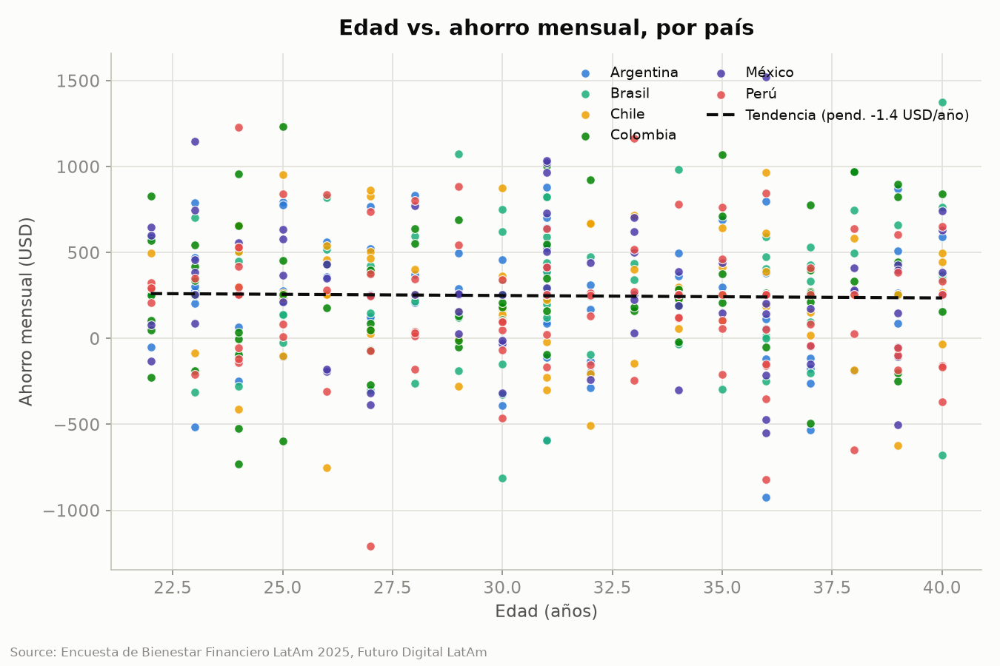
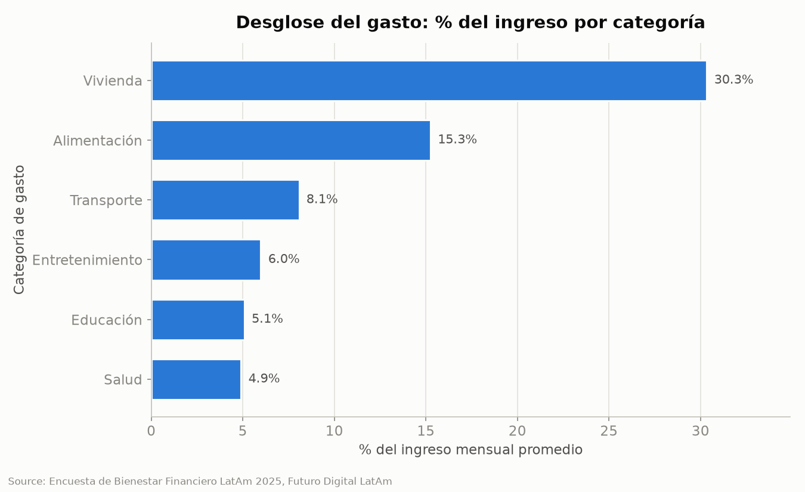
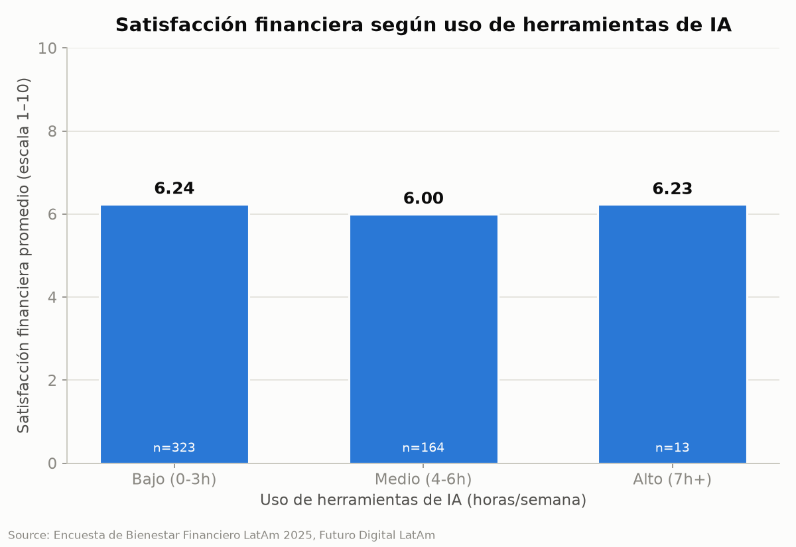
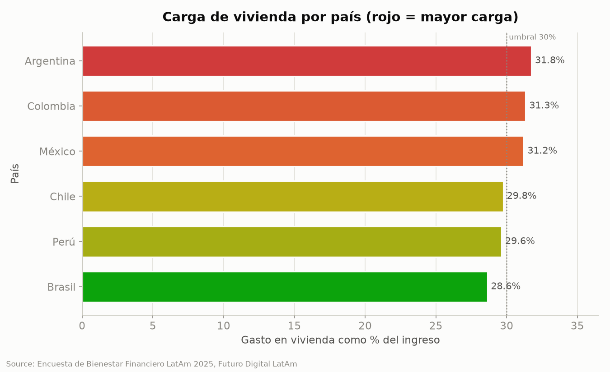

> ## ⚠️ AVISO — DATOS SINTÉTICOS — LEER PRIMERO
> **Este informe se basa en un conjunto de datos generado por computadora (sintético), no en una encuesta real.**
> El archivo fuente (`data/latam_finanzas_2025.csv`, descrito como "500 respuestas reales de encuesta")
> fue producido por un generador con semilla fija (`scripts/00_generate_data.py`), que crea 500 registros
> ficticios con estructura realista y problemas de calidad inyectados a propósito.
>
> **Cada número, tabla, gráfica y "hallazgo" de este documento describe datos generados aleatoriamente —
> no el comportamiento de profesionales reales de América Latina.** Ninguna conclusión aquí debe usarse
> para decisiones, publicaciones o programas reales. El documento existe para demostrar el formato del
> informe y validar que el pipeline funciona de extremo a extremo; sustituya el dataset por datos
> genuinos y vuelva a ejecutar `scripts/01`–`04` para obtener un informe con significado real.

---

# Datos que Hablan: Bienestar Financiero de Jóvenes Profesionales en América Latina
## Informe Ejecutivo — Futuro Digital LatAm, 2025

---

### 1. Resumen Ejecutivo

> *Nota: los datos de este informe son sintéticos (ver aviso arriba); las cifras y recomendaciones son ilustrativas, no reales.*

La Encuesta de Bienestar Financiero LatAm 2025 recoge las finanzas de 500 jóvenes profesionales (22–40 años) en seis países de la región. Tres hallazgos destacan. **Primero, la vivienda es la principal tensión financiera:** absorbe en promedio el 30.3% del ingreso y supera el umbral de asequibilidad del 30% en Argentina (31.8%), Colombia (31.3%) y México (31.2%). **Segundo, y de forma contraintuitiva, el ahorro disminuye con la edad:** los menores de 25 ahorran ~15% de su ingreso frente a solo ~13% en los mayores de 29, pese a estar en su etapa de mayores ingresos. **Tercero, el acceso a productos financieros formales se asocia con más ahorro:** quienes tienen tarjeta de crédito ahorran 14.4% más que quienes no la tienen, aun ganando 4.7% menos.

Recomendamos, en consecuencia, **(1) dirigir intervenciones prioritarias de ahorro a los profesionales de 29 años en adelante**, el grupo con menor capacidad de ahorro y casi la mitad de la muestra; y **(2) priorizar contenido de optimización del gasto en vivienda en Argentina, Colombia y México**, los mercados más presionados. El uso de herramientas de IA no mostró relación con el bienestar financiero y no debe tratarse como palanca del programa.

---

### 2. Metodología

**Conjunto de datos.** El análisis parte de `data/latam_finanzas_2025.csv`, un conjunto de 500 registros de jóvenes profesionales en Argentina, Brasil, Chile, Colombia, México y Perú. **(Ver el aviso inicial: los datos son sintéticos, generados con semilla fija por `scripts/00_generate_data.py`.)** Cada registro contiene 20 variables: demográficas (edad, país, industria, ocupación), financieras (ingreso, ahorro y deuda mensuales en USD), seis categorías de gasto, satisfacción financiera (escala 1–10), horas semanales de uso de herramientas de IA, meta financiera y tres indicadores binarios (tarjeta de crédito, cuenta de ahorro, deuda).

**Enfoque.** El pipeline es reproducible y consta de scripts numerados: exploración (`01_explore.py`), limpieza (`02_clean.py`), análisis (`03_analyse.py`) y visualización (`04_visualise.py`), más perfiles por país generados en paralelo.

**Problemas de calidad detectados y resueltos.**

- **Inconsistencia en `industria`:** 29 variantes de escritura (mayúsculas, acentos, abreviaturas y sinónimos como `TEC`, `ti`, `Tech`, `Tecnología`) se estandarizaron a **7 categorías** canónicas mediante un mapa de normalización.
- **Valores faltantes:** se imputó con la **mediana** las columnas con hasta 40% de ausencias —edad (5%), ingreso (8%), ahorro (15%), satisfacción (6%) y horas de IA (4%)— para preservar los 500 registros. `deuda_total_usd`, con 45% de ausencias, se **dejó sin imputar** por ser demasiado alta para hacerlo de forma fiable.
- **Ahorro negativo:** 110 registros presentan ahorro mensual negativo (gasto que excede el ingreso). Son válidos y **no se eliminaron**; se marcaron con la columna booleana `ahorro_negativo` para análisis de riesgo.
- **Codificación:** se confirmó lectura/escritura en UTF-8 para preservar acentos y caracteres (México, Perú, Educación).

**Limitaciones.** Más allá del carácter sintético de los datos, la imputación con la mediana global del ingreso ($1,784.81) explica que Brasil, Chile y Perú compartan exactamente esa mediana; la segmentación por ingreso debería usar la distribución completa, no solo la mediana. Los hallazgos son correlacionales y no establecen causalidad.

---

### 3. Perfil de la Muestra

Los 500 registros corresponden a jóvenes profesionales de **22 a 40 años** (media 30.9, mediana 31).

**Por país** (n=500):

| País | N |
|---|---:|
| Perú | 94 |
| Brasil | 92 |
| Colombia | 85 |
| Argentina | 78 |
| México | 78 |
| Chile | 73 |

**Por grupo de edad:** 18-22: 21 · 23-25: 81 · 26-28: 73 · 29-32: 129 · 33-36: 106 · 37-40: 90. La muestra se concentra en los 29 años en adelante (325 registros, 65%).

**Por industria** (7 categorías tras estandarización): Tecnología 126 · Finanzas 83 · Comercio 64 · Educación 63 · Salud 60 · Manufactura 59 · Gobierno 45.

**Por ocupación:** Contador/a 74 · Docente 69 · Diseñador/a 67 · Médico/a 65 · Analista 59 · Emprendedor/a 58 · Ingeniero/a 55 · Gerente 53.

**Metas financieras:** Comprar casa 92 · Ahorrar para retiro 90 · Iniciar negocio 86 · Pagar deudas 85 · Viajar 82 · Fondo de emergencia 65.

**Productos y situación financiera:** 255 tienen tarjeta de crédito (51%) y 245 no; 268 tienen cuenta de ahorro (54%) y 232 no; la deuda está casi dividida (248 con deuda, 252 sin). **110 registros (22%) reflejan gasto mayor al ingreso** (ahorro negativo).

---

### 4. Hallazgos

#### 4.1 Ingreso mediano por país

**Hallazgo estadístico.** El ingreso mediano mensual va de $1,840.79 (Colombia) a $1,758.35 (México), un rango de apenas 4.7%. Argentina $1,788.17; Brasil, Chile y Perú $1,784.81. La desviación estándar por país va de $583.55 (Brasil) a $810.85 (México).

**Interpretación.** El ingreso mensual mediano de los jóvenes profesionales es notablemente homogéneo entre los seis países, con un rango de apenas 4.7% que va de $1,840.79 en Colombia (el más alto) a $1,758.35 en México (el más bajo), mientras Brasil, Chile y Perú coinciden en $1,784.81. Esta similitud implica que Futuro Digital LatAm puede diseñar un único currículo regional de educación financiera calibrado a una línea base común (~$1,780/mes) sin ajustes mayores por país, aunque la amplia dispersión dentro de cada país (desviación estándar de $583.55 en Brasil a $810.85 en México) revela que el público más heterogéneo —y por tanto el más difícil de atender con un mensaje único— son los profesionales mexicanos. Se recomienda segmentar a los participantes por nivel de ingreso individual (por ejemplo, en quintiles dentro de cada país) en lugar de por nacionalidad, ya que la variación interna supera con creces las diferencias entre países.

**Gráfica.** 

#### 4.2 Edad vs. ahorro

**Hallazgo estadístico.** El ahorro mensual promedio y la tasa de ahorro descienden con la edad: 18-22: $285.40 (14.9%) · 23-25: $266.65 (15.1%) · 26-28: $246.92 (14.8%) · 29-32: $236.36 (13.2%) · 33-36: $253.00 (14.0%) · 37-40: $236.15 (13.2%). Línea de tendencia: −1.4 USD por año de edad.

**Interpretación.** El ahorro mensual promedio disminuye con la edad, cayendo de $285.40 (tasa de ahorro del 14.9%) en el grupo de 18-22 años a $236.15 (13.2%) en el de 37-40 años, con una línea de tendencia levemente negativa (−1.4 USD por año de edad). Este patrón contraintuitivo —se esperaría que el ahorro creciera con la edad y la experiencia— es más relevante para los profesionales de 29 años en adelante (grupos 29-32 y 37-40, ambos con tasa de solo 13.2%), que representan casi la mitad de la muestra y son quienes muestran la menor capacidad de ahorro pese a estar en su etapa de mayores ingresos. Se recomienda que Futuro Digital LatAm dirija intervenciones prioritarias de ahorro automatizado y planeación de metas a los cohortes de 29+ años, aprovechando además los buenos hábitos de los menores de 25 (tasa ~15%) como modelo y contenido testimonial del programa.

**Gráfica.** 

#### 4.3 Desglose de gasto

**Hallazgo estadístico.** Como % del ingreso: Vivienda 30.3% ($538.84) · Alimentación 15.3% ($270.82) · Transporte 8.1% ($143.33) · Entretenimiento 6.0% ($106.28) · Educación 5.1% ($90.27) · Salud 4.9% ($87.11). Gasto categorizado total: 69.6%.

**Interpretación.** El gasto se concentra fuertemente en dos rubros esenciales: la vivienda absorbe el 30.3% del ingreso ($538.84 en promedio) y la alimentación el 15.3% ($270.82), de modo que juntos consumen el 45.6% del ingreso mensual, mientras transporte (8.1%), entretenimiento (6.0%), educación (5.1%) y salud (4.9%) suman el resto hasta un gasto categorizado total del 69.6%. Que la vivienda se sitúe justo en el umbral de asequibilidad del 30% implica que los jóvenes profesionales de menores ingresos son los más vulnerables —para quien gana cerca del mínimo de $300 mensuales, un gasto fijo de vivienda proporcionalmente similar deja un margen mínimo para ahorrar—, por lo que el programa de Futuro Digital LatAm debe centrar su contenido presupuestal en estos dos rubros dominantes. Se recomienda crear un módulo práctico de "presupuesto 50/30/20 adaptado" que ataque directamente los costos de vivienda y alimentación (renta compartida, planificación de compras) y convierta el ~30% del ingreso no absorbido por estas categorías en metas concretas de ahorro.

**Gráfica.** 

#### 4.4 Tarjeta de crédito vs. ahorro

**Hallazgo estadístico.** Tenedores (n=255) vs. no tenedores (n=245): Ingreso $1,733.43 vs $1,819.55 (−4.7%) · Alimentación $264.68 vs $277.22 (−4.5%) · Entretenimiento $107.10 vs $105.43 (+1.6%) · Ahorro $264.68 vs $231.37 (+14.4%).

**Interpretación.** Los tenedores de tarjeta de crédito (n=255) ganan un 4.7% menos que los no tenedores ($1,733.43 frente a $1,819.55) y gastan un 4.5% menos en alimentación, pero ahorran un 14.4% más ($264.68 frente a $231.37 al mes), la mayor diferencia entre todas las métricas comparadas. Esto sugiere que el acceso a productos financieros formales se asocia con mejores hábitos de ahorro más allá del nivel de ingreso, un patrón especialmente relevante para el segmento de no tenedores (n=245, casi la mitad de la muestra), que pese a ingresos algo mayores ahorra menos y podría estar excluido de herramientas básicas de gestión financiera. Se recomienda que Futuro Digital LatAm incorpore un módulo de inclusión y uso responsable de productos crediticios dirigido a los no tenedores, validando primero la dirección causal (¿la tarjeta impulsa el ahorro o quienes ya ahorran acceden a ella?) antes de promover activamente su adopción.

**Gráfica.** 

#### 4.5 Uso de IA vs. satisfacción financiera

**Hallazgo estadístico.** Bajo (0-3h): n=323, satisfacción 6.24, ingreso $1,765.21 · Medio (4-6h): n=164, 6.00, $1,791.88 · Alto (7h+): n=13, 6.23, $1,829.45. Correlación de Pearson r = −0.058 (p = 0.196, n = 500): sin correlación significativa.

**Interpretación.** No existe correlación estadísticamente significativa entre las horas semanales de uso de herramientas de IA y la satisfacción financiera (Pearson r = −0.058, p = 0.196, n = 500), y la satisfacción promedio es prácticamente plana entre los tres grupos —6.24 en uso bajo (0-3h, n=323), 6.00 en uso medio (4-6h, n=164) y 6.23 en uso alto (7h+, n=13), en una escala de 1 a 10. Este resultado nulo es relevante porque advierte a Futuro Digital LatAm que la adopción de herramientas de IA no predice el bienestar financiero de ningún segmento, ni siquiera el de usuarios intensivos (grupo alto, apenas n=13), por lo que no debe tratarse como palanca del programa. Se recomienda no invertir recursos en alfabetización en IA como vía hacia el bienestar financiero y, en cambio, redirigir ese esfuerzo a los factores con efecto demostrado (ahorro por edad y carga de vivienda), recolectando más datos de usuarios de uso alto solo si se desea evaluar el tema con potencia estadística adecuada.

**Gráfica.** 

#### 4.6 Carga de vivienda por país

**Hallazgo estadístico.** Gasto en vivienda como % del ingreso: Argentina 31.8% · Colombia 31.3% · México 31.2% · Chile 29.8% · Perú 29.6% · Brasil 28.6%. Tres países superan el umbral del 30%.

**Interpretación.** La carga de vivienda —gasto en vivienda como porcentaje del ingreso— oscila entre 28.6% en Brasil y 31.8% en Argentina, y tres países superan el umbral de asequibilidad del 30%: Argentina (31.8%), Colombia (31.3%) y México (31.2%), mientras Chile (29.8%), Perú (29.6%) y Brasil (28.6%) quedan justo por debajo. Esto importa porque los jóvenes profesionales argentinos, colombianos y mexicanos son los más presionados por el costo de vivienda y, por tanto, los que disponen de menor margen para ahorrar, mientras que incluso los países por debajo del umbral rondan el límite, confirmando que la vivienda es la principal tensión de gasto en toda la región. Se recomienda que Futuro Digital LatAm priorice contenido de optimización del gasto en vivienda (renta vs. compra, vivienda compartida, negociación de contratos) en Argentina, Colombia y México, y cruce esta carga con la marca de ahorro negativo para identificar y atender primero a los hogares en mayor riesgo financiero.

**Gráfica.** 

---

### 5. Recomendaciones

> *Recomendaciones ilustrativas basadas en datos sintéticos; no aplicar a un programa real sin datos genuinos.*

1. **Priorizar intervenciones de ahorro para los profesionales de 29 años en adelante.** Estos cohortes (29-32 y 37-40, el 65% de la muestra) muestran la menor tasa de ahorro (13.2%) pese a estar en su etapa de mayores ingresos *(Hallazgo 4.2)*. Ofrecer ahorro automatizado y planeación de metas, usando los hábitos de los menores de 25 (~15%) como modelo testimonial.

2. **Concentrar el contenido de educación presupuestal en vivienda y alimentación.** Juntas absorben el 45.6% del ingreso *(Hallazgo 4.3)*. Un módulo de "presupuesto 50/30/20 adaptado" con tácticas concretas (renta compartida, planificación de compras) atacaría el mayor punto de fuga del ingreso.

3. **Focalizar geográficamente el contenido de vivienda en Argentina, Colombia y México.** Los tres superan el umbral de asequibilidad del 30% *(Hallazgo 4.6)*. Complementar con material sobre decisiones de vivienda (renta vs. compra, ubicación, negociación de contratos) y cruzar con la marca `ahorro_negativo` para atender primero a los hogares en riesgo (22% de la muestra).

4. **Impulsar la inclusión financiera formal entre los no tenedores de productos financieros.** Los tenedores de tarjeta de crédito ahorran 14.4% más pese a ingresos algo menores *(Hallazgo 4.4)*. Incorporar un módulo de uso responsable de crédito y apertura de cuentas de ahorro (232 registros aún no la tienen), validando la causalidad antes de promover activamente la adopción de tarjetas.

5. **Diseñar un único currículo regional, segmentado por ingreso individual y no por país.** El ingreso mediano es casi idéntico entre los seis países (rango 4.7%), pero la variación interna es mucho mayor *(Hallazgo 4.1)*. Un currículo común calibrado a ~$1,780/mes, con rutas por quintil de ingreso, es más eficiente que seis programas nacionales. **No** invertir en alfabetización en IA como vía de bienestar financiero: no mostró relación con la satisfacción *(Hallazgo 4.5)*.

---

### 6. Conclusión

El bienestar financiero de los jóvenes profesionales de América Latina se perfila como frágil pero manejable: ingresos regionalmente homogéneos (~$1,780/mes), una carga de vivienda que roza o supera el umbral del 30% en la mitad de los países, y tasas de ahorro modestas (13–15%) que, contra lo esperado, decrecen con la edad. El acceso a productos financieros formales se asocia con mayor ahorro, lo que señala la inclusión como palanca prometedora. Estas conclusiones, no obstante, derivan de un conjunto de datos **sintético** generado con semilla fija, no de una encuesta real; ilustran el formato del informe y deben reconfirmarse con datos genuinos antes de cualquier decisión.

---

*Fuente de todos los datos: Encuesta de Bienestar Financiero LatAm 2025, Futuro Digital LatAm (n=500) — **datos sintéticos** (ver aviso inicial). Análisis reproducible en `scripts/`; estadísticas exactas en `scripts/findings_summary.md`.*
