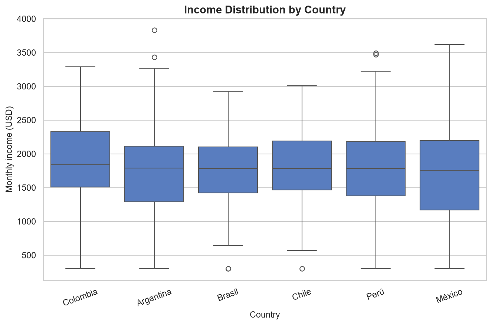
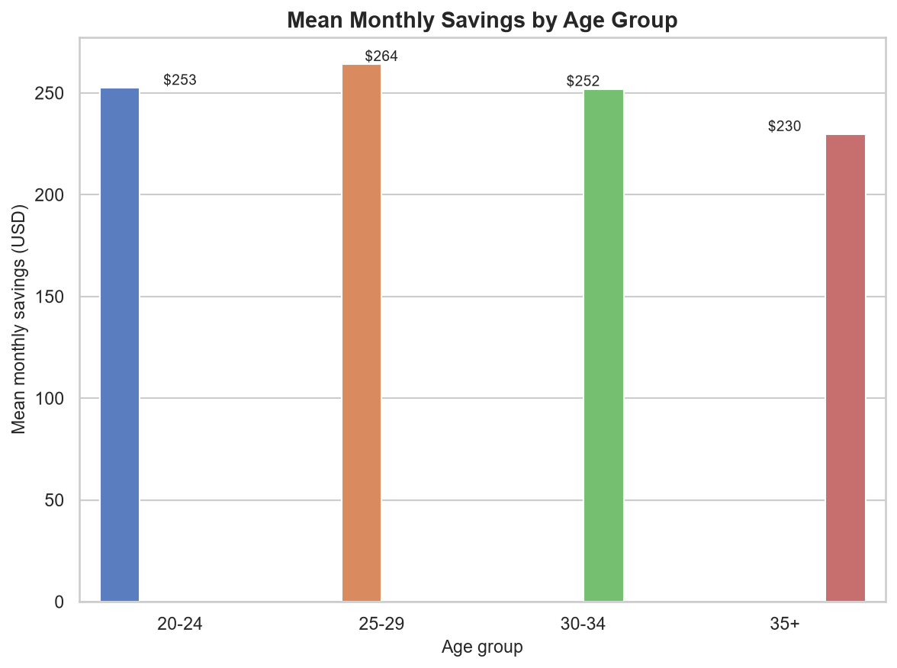
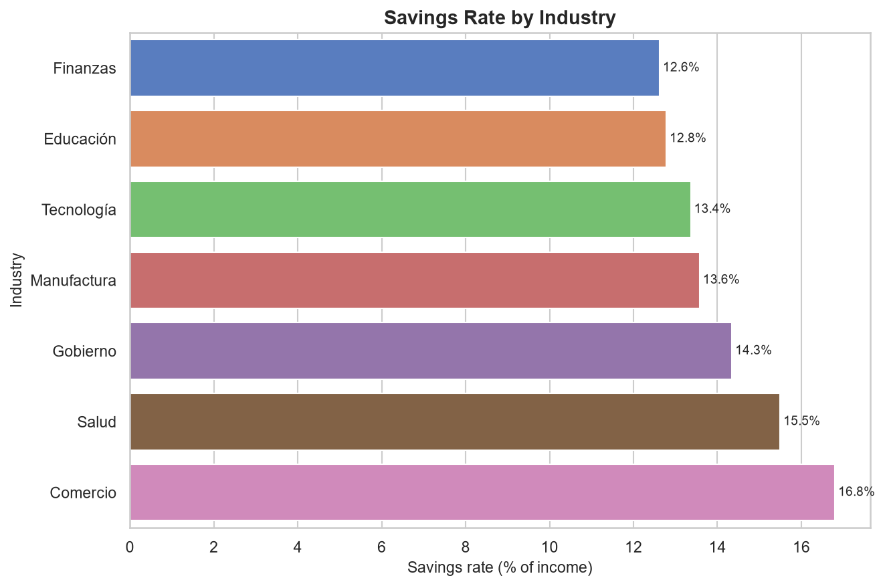
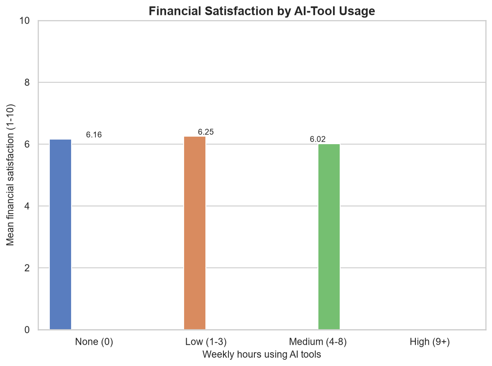
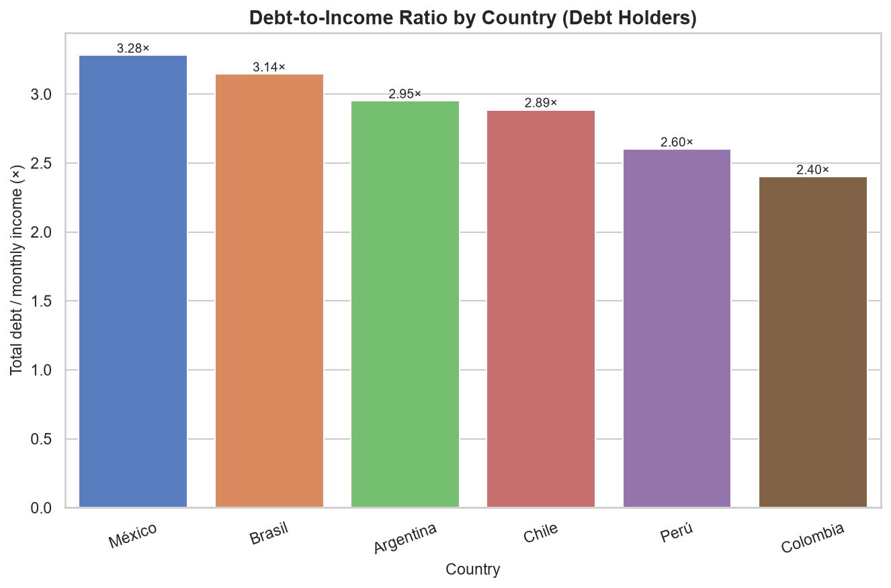

# Financial Wellness of Young Professionals in Latin America — Analysis Report

> ## ⚠️ SYNTHETIC DATA NOTICE — READ FIRST
> **This report is based on a computer-generated (synthetic) dataset, not a real survey.** The
> intended source file (`data/latam_finanzas_2025.csv`, described as 500 real survey responses) was
> never available in the project. To build and validate the analysis pipeline end-to-end, a seeded
> random generator (`scripts/00_generate_data.py`) produced 500 fake records with realistic-looking
> structure and deliberately injected data-quality issues.
>
> **Every number, table, chart, and "finding" below therefore describes randomly generated data — not
> the behaviour of real Latin American professionals.** No conclusion here should be used for any real
> decision, publication, or programme. The document exists to demonstrate the reporting format and to
> prove the pipeline works; replace the dataset with genuine data and re-run `scripts/01`–`04` to
> obtain a report with real meaning.

---

## 1. Executive Summary

This study set out to examine the financial wellness of young professionals across six Latin American
countries, using a 500-respondent dataset covering income, expenses, savings, debt, industry, and
adoption of AI tools. **The dataset analysed here is synthetic** (see notice above), so the results
characterise generated data rather than a real population; they are presented to illustrate the
analytical workflow.

Within this synthetic sample, respondents report a mean age of **30.9 years** and a modest overall
savings rate of **≈14.0%** of income. Savings behaviour is broadly flat across age groups (mean
monthly savings **$230–$264**), and **22.0%** of respondents record *negative* monthly savings —
i.e., spending exceeds income. Income distributions are strikingly similar across countries
(country means **$1,723–$1,863**), a direct artefact of the data-generation process.

Debt is widespread: **49.6%** report holding debt, and among those, total debt equals roughly
**2.4×–3.3× monthly income**, highest in **México (3.28×)** and **Brasil (3.14×)**. AI-tool adoption
is high (**93.8%** use them at least occasionally), but shows **no measurable relationship** with
financial satisfaction (flat at ≈6.0–6.3 / 10). The only strong statistical relationship is between
income and total expenses (**r = 0.91**), which is built into the generator.

The recommendations that follow are framed as *illustrations* of how findings would translate into
financial-literacy programme actions. They must be re-derived from real data before any use.

## 2. Methodology

### 2.1 Data origin
The project specification referenced a real survey file, `data/latam_finanzas_2025.csv` (500 young
professionals across Latin America). **That file was never present** in the project environment and
could not be located on the system. To proceed with pipeline development, a **synthetic dataset was
generated** by `scripts/00_generate_data.py` using a fixed random seed (reproducible). All subsequent
analysis operates on this generated data.

### 2.2 Variables
The dataset contains 500 rows and the following key variables:

| Category | Variables |
| --- | --- |
| Demographic | `edad` (age), `pais` (country), `industria`, `ocupacion` |
| Income & savings | `ingreso_mensual_usd`, `ahorro_mensual_usd` |
| Expenses (monthly) | `gasto_vivienda_usd`, `gasto_alimentacion_usd`, `gasto_transporte_usd`, `gasto_entretenimiento_usd`, `gasto_educacion_usd`, `gasto_salud_usd` |
| Debt | `deuda_total_usd`, `tiene_deuda` |
| Behaviour / tech | `satisfaccion_financiera` (1–10), `horas_herramientas_ia_semana` |
| Product ownership | `tiene_tarjeta_credito`, `tiene_cuenta_ahorro` |

> **Note:** the expense breakdown, `satisfaccion_financiera`, and `horas_herramientas_ia_semana`
> columns were **defined by the analyst** when extending the generator for Phases 3–4. Real-world
> column names may differ.

### 2.3 Cleaning steps applied
Cleaning (`scripts/02_clean.py`) applied the following, with no rows dropped (500 → 500):

1. **Standardised `industria`** — collapsed **29 raw variants** (casing, abbreviations, whitespace,
   e.g. `TEC`/`ti`/`IT`/`Tech` → *Tecnología*) into **7 canonical categories**.
2. **Median-imputed** numeric columns below a 40%-missing threshold: `edad` (5% missing),
   `ingreso_mensual_usd` (8%), `ahorro_mensual_usd` (15%), `satisfaccion_financiera` (6%),
   `horas_herramientas_ia_semana` (4%).
3. **Left un-imputed**: `deuda_total_usd` (**45% missing**, above threshold) — debt figures below
   rest on the non-missing ~55% of records.
4. **Flagged, not removed**, negative savings in a new boolean column `ahorro_negativo`
   (**110 records, 22.0%**), treated as valid (spending > earning).

## 3. Sample Profile

- **Size & age:** 500 respondents; mean age **30.9**, median **31**.
- **Geography:** distributed across six countries —

| Country | Respondents |
| --- | --- |
| Perú | 94 |
| Brasil | 92 |
| Colombia | 85 |
| México | 78 |
| Argentina | 78 |
| Chile | 73 |

- **Top industries:** **Tecnología (126)**, Finanzas (83), Comercio (64), Educación (63), Salud (60),
  Manufactura (59), Gobierno (45).
- **Product ownership:** credit card **51.0%**, savings account **53.6%**, holds debt **49.6%**.
- **Technology adoption:** **93.8%** use AI tools at least occasionally (mean **2.96 hrs/week**); only
  **6.2%** report zero use. No respondent reported 9+ hrs/week, so the "High" usage band is empty.

## 4. Findings

*All figures describe the synthetic dataset.*

### 4.1 Cost of Living vs Income (by country)
Country-level income and expenses are tightly clustered; savings rates span **10.7%–15.7%**.

| Country | Avg income (USD) | Avg total expenses (USD) | Savings rate |
| --- | --- | --- | --- |
| Colombia | 1,862.66 | 1,330.89 | **14.83%** |
| Chile | 1,811.58 | 1,239.11 | 13.79% |
| Perú | 1,775.94 | 1,215.70 | **10.65%** |
| México | 1,753.17 | 1,230.98 | **15.71%** |
| Brasil | 1,729.84 | 1,168.21 | 15.40% |
| Argentina | 1,723.22 | 1,243.29 | 13.91% |

**Insight:** México shows the highest savings rate (**15.71%**) and Perú the lowest (**10.65%**), but
the spread is narrow — an artefact of the generator, not a real economic signal.

### 4.2 Savings Patterns by Age Group
Mean monthly savings are essentially flat across age, dipping slightly in the oldest band.

| Age group | n | Mean savings (USD) | Median savings (USD) |
| --- | --- | --- | --- |
| 20–24 | 79 | 252.50 | 255.59 |
| 25–29 | 116 | **264.20** | 255.59 |
| 30–34 | 158 | 251.94 | 255.59 |
| 35+ | 147 | **229.78** | 255.59 |

**Insight:** the identical median (**$255.59**) across every group is a direct consequence of
median-imputing 75 missing savings values; it is not a genuine pattern.

### 4.3 Industry Benchmarks
Comercio leads on both mean savings and share of positive savers.

| Industry | n | Mean income (USD) | Mean savings (USD) | % positive savers |
| --- | --- | --- | --- | --- |
| Tecnología | 126 | 1,856.27 | 248.08 | 79.4% |
| Comercio | 64 | 1,848.91 | **310.61** | **85.9%** |
| Educación | 63 | 1,751.87 | 223.93 | 73.0% |
| Salud | 60 | 1,731.58 | 268.30 | 78.3% |
| Finanzas | 83 | 1,729.93 | **218.33** | 75.9% |
| Manufactura | 59 | 1,725.88 | 234.30 | 76.3% |
| Gobierno | 45 | 1,687.09 | 242.02 | 75.6% |

**Insight:** on a savings-rate basis (mean savings ÷ mean income), Comercio leads at **16.8%** and
Finanzas trails at **12.6%**.

### 4.4 Financial Satisfaction & AI-Tool Usage
Satisfaction is flat across usage bands; no dose-response relationship appears.

| AI usage (hrs/week) | n | Avg satisfaction (1–10) | Avg savings (USD) |
| --- | --- | --- | --- |
| None (0) | 31 | 6.16 | 247.18 |
| Low (1–3) | 292 | **6.25** | 261.52 |
| Medium (4–8) | 177 | 6.02 | 226.85 |
| High (9+) | 0 | — | — |

**Insight:** heavier AI use is **not** associated with higher financial satisfaction in this data.

### 4.5 Debt Analysis (debt holders only)
Among the **49.6%** who hold debt, total debt runs **2.4×–3.3× monthly income**.

| Country | n | Mean debt (USD) | Mean monthly income (USD) | Debt-to-income |
| --- | --- | --- | --- | --- |
| México | 41 | 5,478.23 | 1,669.66 | **3.28×** |
| Brasil | 43 | 5,550.41 | 1,765.14 | 3.14× |
| Argentina | 35 | 5,146.50 | 1,744.42 | 2.95× |
| Chile | 34 | 5,244.42 | 1,817.25 | 2.89× |
| Perú | 49 | 4,579.98 | 1,761.25 | 2.60× |
| Colombia | 46 | 4,340.76 | 1,808.43 | **2.40×** |

**Insight:** México and Brasil carry the heaviest debt burdens relative to income. *(Based on the
~55% of records with non-missing debt values.)*

### 4.6 Correlation Matrix (Pearson)
Only income–expenses is strongly correlated; all other relationships are negligible.

|  | Age | Income | Total Expenses | AI Hours | Fin. Satisfaction |
| --- | --- | --- | --- | --- | --- |
| **Age** | 1.000 | 0.017 | -0.014 | 0.064 | -0.122 |
| **Income** | 0.017 | 1.000 | **0.912** | 0.007 | 0.006 |
| **Total Expenses** | -0.014 | **0.912** | 1.000 | 0.021 | -0.001 |
| **AI Hours** | 0.064 | 0.007 | 0.021 | 1.000 | -0.058 |
| **Fin. Satisfaction** | -0.122 | 0.006 | -0.001 | -0.058 | 1.000 |

**Insight:** the **r = 0.91** income–expense link is by construction (expenses were generated as a
fixed fraction of income). Satisfaction correlates with nothing measured here.

## 5. Recommendations

*These are illustrative — they show how findings would inform a financial-literacy programme. They
must be re-validated on real data before any real-world action.*

1. **Target negative savers first.** With **22.0%** of respondents saving nothing (negative monthly
   savings, §2.3/§4.2), prioritise a budgeting module that helps this segment reach a positive cash
   flow before any investment content.
2. **Launch debt-reduction support in high-burden markets.** Debt-to-income reaches **3.28×** in
   México and **3.14×** in Brasil (§4.5); pilot debt-consolidation and repayment coaching there first.
3. **Raise the overall savings rate from ≈14%.** Since savings are flat across age and country
   (§4.1/§4.2), deliver a universal "pay-yourself-first" automation curriculum rather than
   age-segmented content.
4. **Decouple tech adoption from financial confidence.** AI-tool use is high (**93.8%**) yet unrelated
   to satisfaction (§4.4); embed financial-literacy content *inside* the AI tools people already use,
   rather than assuming adoption alone improves outcomes.
5. **Improve debt-data collection.** The **45% missing rate** on `deuda_total_usd` (§2.3) undermines
   debt analysis; make this field mandatory in future survey waves.

## 6. Conclusion

Within this **synthetic** dataset, financial wellness looks fragile but uniform: modest savings rates
near **14%**, roughly a fifth of respondents spending more than they earn, and debt burdens of
**2.4×–3.3×** monthly income among the half who carry debt. High AI-tool adoption shows no link to
financial satisfaction, and income is the dominant driver of spending. These patterns, however, are
products of a random data generator and carry **no real-world meaning**. The genuine value delivered
here is a validated, reproducible pipeline: once a real survey file replaces the synthetic one and
`scripts/01`–`04` are re-run, this same report structure will yield findings that can responsibly
inform a financial-literacy programme.

---
*Generated from synthetic data via `scripts/00`–`04`. Not for real-world use.*
